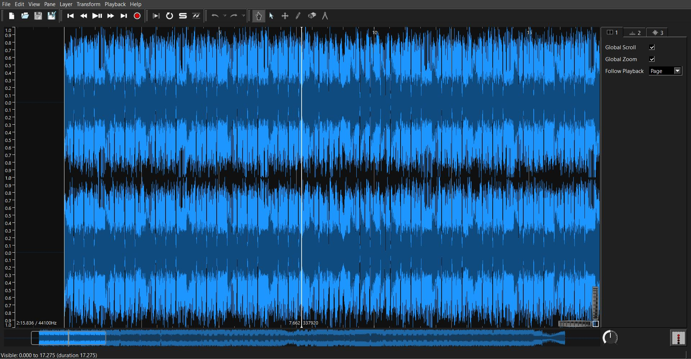

# Wat O_O Writeup

# Step 1 - Identifying the problem

It was literally just a 2 and a half minute video. We watched it a lot, and after a while it was noticed that, compared to the original on YouTube/Spotify, there was a strange inteference-like beeping over some periods of the track. We then knew that this must be where the flag is.

# Step 2 - Viewing the anomalies

I downloaded Sonic Visualiser, and used it to open the .wav file. It looked like the following:

This was just the wave, so a spectrogram was added. This resulted in darker, red vertical bars being revealed in parts of the track where the anomalies could be heard. After changing the colour scheme to make this more clear, it looked like this:
- image 2

We spent a while listening to the anomalies on a very slow speed, trying to translate the beeps into a flag by hand using morse code. For a while we managed to convince ourselves that it /was/ morse code, and we had a few characters next to each other that could make up words.
Ultimately we abandoned this, after we started to get some promising results in binary.
The anomalies were scattered all across the track, so we chose a section about two-thirds of the way through and got to work translating the anomalies into 0s and 1s.
My teammate [link] was listening to a slowed down version of the beeps and writing down the 0s and 1s based on the length of the beeps and the silence inbetween them - whereas I looked at the visual representation of the binary and wrote it down using that.
After tweaking the colours once more to make the binary a little more clear, the binary could be revealed as shown by the following image:
- image 3

Finding the binary 01111101, representing } in ASCII/UTF-8, in the file was a good sign as this was likely to be the end of the flag. Working backwards from here the letters of the flag are revealed.
Repeating this process all the way bag to the beginning of the flag format X-MAS{, we obtained the flag:

> X-MAS{CRCRCRUSH_CORERERE}

We enjoyed completing this challenge and ended up doing so just 5 hours 41 minutes after the challenge's release. This was made even sweeter by the fact that we were the first team to submit the flag. This awarded our team, 'C♭'/'C Flat', the Xenon award:
- images 4 and 5
